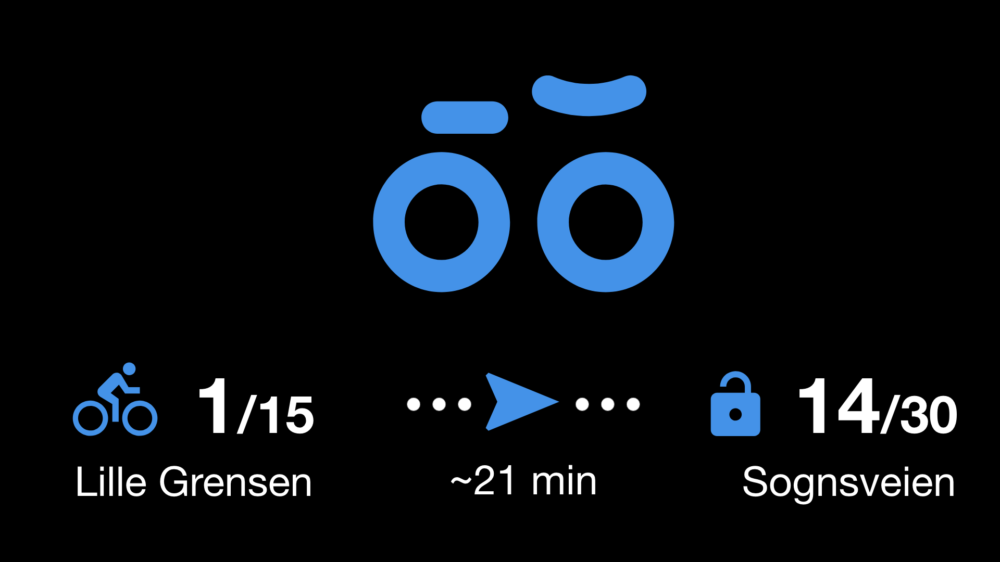

# MagicMirror² Module: Bysykkel

MagicMirror² module for showing the availability of the city bikes around in Norway. It is using data from [Urban Infrastructure Partner AS](http://www.urbansharing.com/) and [Oslo Bysykkel](https://oslobysykkel.no/), licenced under the [Norwegian Licence for Open Government Data (NLOD)](https://data.norge.no/nlod/en/2.0).

This module is inspired by the [MMM-OsloCityBike](https://github.com/TobbenTM/MMM-OsloCityBike) module from TobbenTM.

  
_Primary mode, with both departure and arrival stations defined._


  
_Secondary, simple mode with only departure station defined._

## Installation

Remote to your MM2-box with your terminal software and go to your MagicMirror's Module folder:

```bash
cd ~/MagicMirror/modules
```

Clone the repository:

```bash
git clone https://github.com/JonasTriki/MMM-Bysykkel.git
```

Go to the modules folder:

```bash
cd MMM-Bysykkel
```

Install the dependencies:

```bash
npm install
```

Add the module to the modules array in the `config/config.js` file by adding the following section. You can change this configuration later when you see this works:

```
{
	module: "MMM-Bysykkel",
	position: "middle_center",
	config: {}
},
```

# Configuration options

These are the valid configuration options you can put inside the config array above:

| Configuration option | Comment                                                                                                                                                                                                    | Default                       |
| -------------------- | ---------------------------------------------------------------------------------------------------------------------------------------------------------------------------------------------------------- | ----------------------------- |
| updateInterval       | Refresh rate in MS for how often we call the API's. Don't set this too low, most of the data refreshes every 10s anyway.                                                                                   | 30000                         |
| clientIdentifier     | Client identifier for the module (as [specified by the documentation](https://oslobysykkel.no/en/open-data/realtime), under "Identification in header")                                                    | "magicmirror-module-bysykkel" |
| googleMapsApiKey     | [Google Maps API Key](https://developers.google.com/maps/documentation/javascript/get-api-key) for calculating the time between the city bike stops. Required if you want estimated time between stations. | ""                            |
| city                 | What city we're biking in.                                                                                                                                                                                 | "bergen"                      |
| stations        | List of desited stations with their respective starting and end identifiers. The stations are shown in order. If the end station identifier is set to -1, the module will display a simple variant (see screenshot 2).                                                                                                                       | [{from: 3, to: 5}]                             |
| displaySingleStationName          | Whether to display the station name if only from station is specified.                                                                                                                          | false                             |

For from and to stations IDs, please visit the the documentation of the cities for reference.

## Cities

This module supports the following cities:

| City      | Documentation                                                    |
| --------- | ---------------------------------------------------------------- |
| Oslo      | [Oslo Bysykkel Developer](https://oslobysykkel.no/apne-data)     |
| Bergen    | [Bergen Bysykkel API](https://bergenbysykkel.no/apne-data)       |
| Trondheim | [Trondheim Bysykkel API](https://trondheimbysykkel.no/apne-data) |

## Translations

This modules is translated to the following languages:

| Language       | Responsible |
| -------------- | ----------- |
| en (English)   | Jonas Triki |
| nb (Norwegian) | Jonas Triki |

If you wish to contribute, please make a pull request.

# Current development status

This module is currently being maintained, weyy! 🎉
